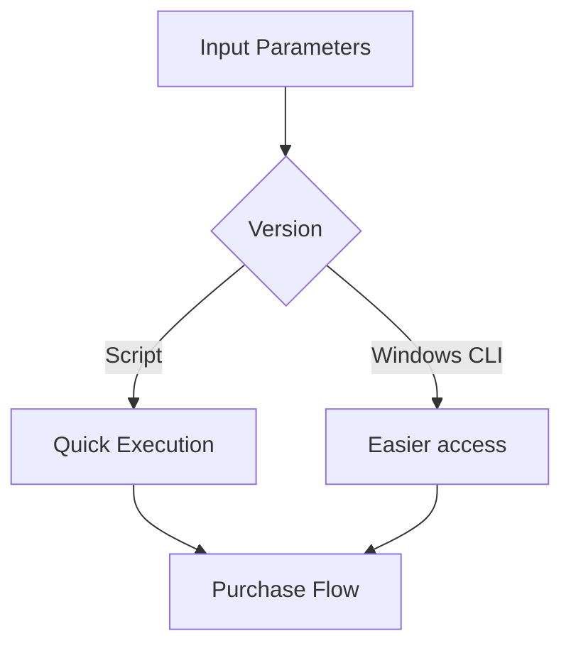
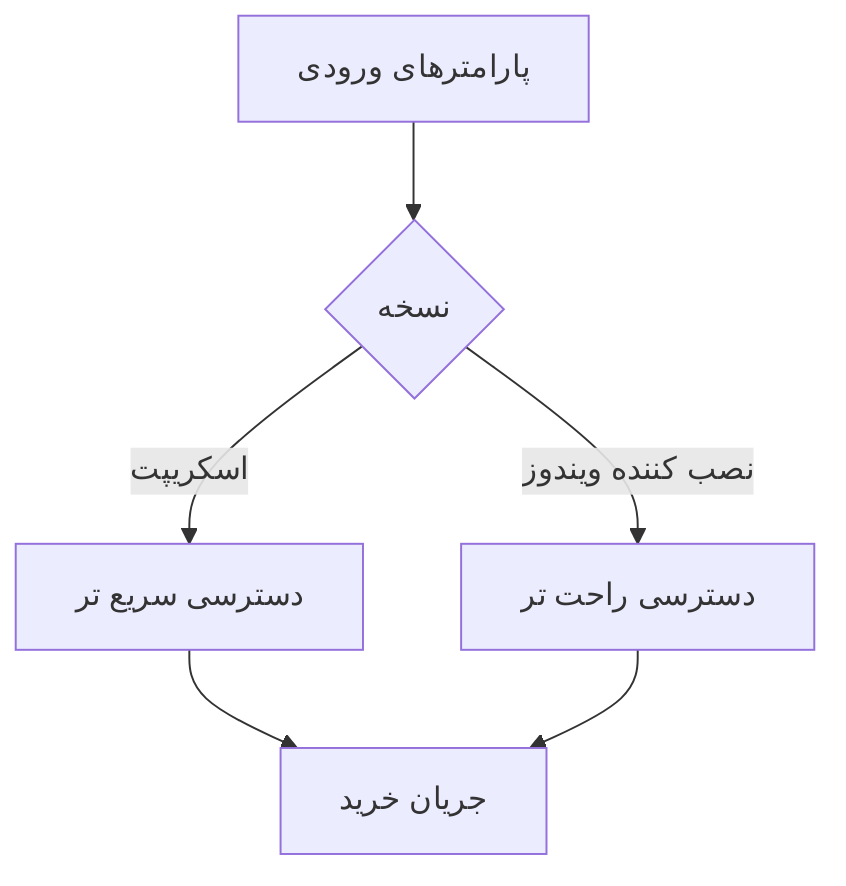

# 🚗 Dtire - Government Tire Purchase Automation System


**Advanced automated system for purchasing government-subsidized tires**  
*(Deprecated due to policy changes - Preserved as top project for technical excellence)*

## 🌟 Key Features
- **Dual Implementation**:
  - CLI Script version (Lightweight)
  - Windows Command-line Application (Enhanced)
- **Core Functionality**:
  - Real-time inventory monitoring
  - Multi-threaded operation
  - Proxy rotation system

```python
# Sample of Windows CLI implementation
class TirePurchaser:
    def __init__(self):
        self.mode = "windows_cli"  # or "script"
```

## ⚠️ Current Status
### Project is inactive because:
  - Government policy changes
  - Platform updates
  - No longer needed


## 📦 Version Comparison
| Feature               | Script Version | Windows CLI App |
|-----------------------|----------------|-----------------|
| Real-time Monitoring  | ✓              | ✓               |
| GUI Interface         | ✗              | ✗               |
| Proxy Support         | Basic          | Advanced        |
| Installation          | PIP            | EXE Installer   |

## ⚙️ Technical Architecture


---

# 🚗 دی تایر - سیستم خرید خودکار لاستیک دولتی


**راهکار پیشرفته خرید خودکار لاستیک‌های دولتی**  
*(منسوخ شده - حفظ شده به عنوان پروژه برتر فنی)*

## 🌟 ویژگی‌های کلیدی
- **پیاده‌سازی دوگانه**:
  - نسخه اسکریپت (سبک‌وزن)
  - برنامه خط فرمان ویندوز (پیشرفته)
- **قابلیت‌های اصلی**:
  - رصد لحظه‌ای موجودی
  - عملکرد چندنخی
  - سیستم چرخش پروکسی


## ⚠️ وضعیت کنونی
### این پروژه به دلایل زیر غیرفعال است:
  - تغییر مکانیزم عرضه لاستیک
  - به‌روزرسانی سامانه‌های دولتی
  - عدم نیاز کاربران

## 📦 مقایسه نسخه‌ها
| قابلیت               | نسخه اسکریپت | برنامه ویندوز |
|-----------------------|--------------|---------------|
| پایش لحظه‌ای          | ✓            | ✓              |
| رابط گرافیکی         | ✗            | ✗              |
| پشتیبانی پروکسی      | پایه        | پیشرفته        |
| نصب                   | PIP          | نصب‌کننده EXE   |

## ⚙️ معماری فنی:



