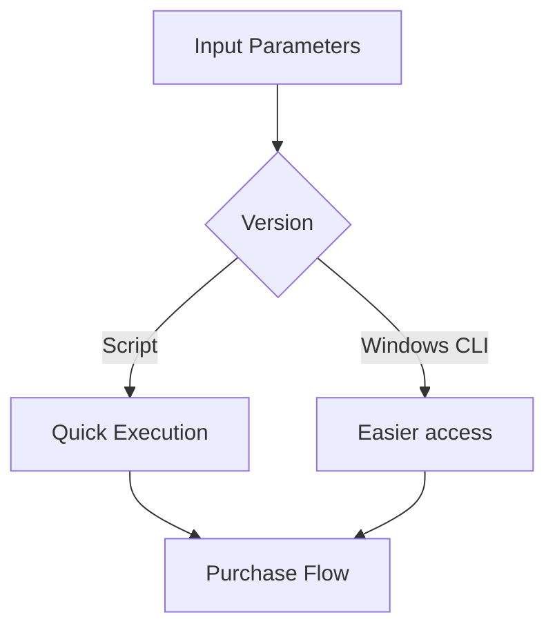
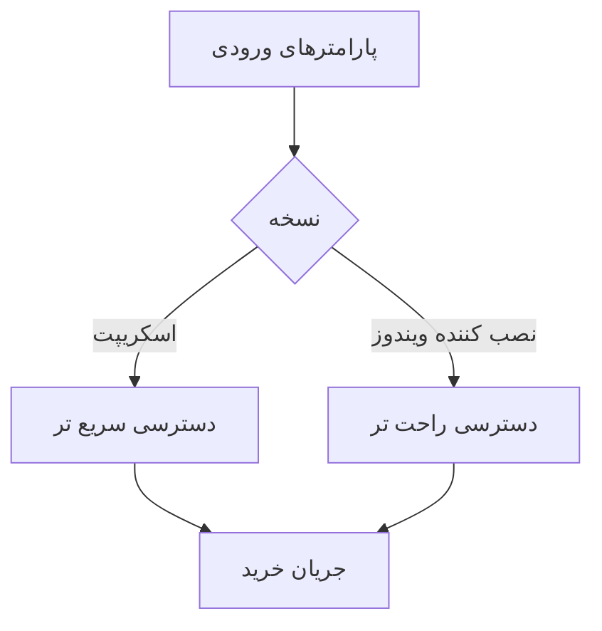
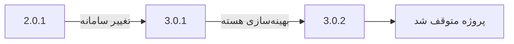

# 🚗 Dtire - Government Tire Purchase Automation System


**Advanced automated system for purchasing government-subsidized tires**  
*(Deprecated due to policy changes - Preserved as top project for technical excellence)*

## 🌟 Key Features
- **Dual Implementation**:
  - CLI Script version (Lightweight)
  - Windows Command-line Application (Enhanced)
- **Core Functionality**:
  - Real-time inventory monitoring
  - Multi-threaded operation
  - Proxy rotation system

```python
# Sample of Windows CLI implementation
class TirePurchaser:
    def __init__(self):
        self.mode = "windows_cli"  # or "script"
```

## ⚠️ Current Status
### Project is inactive because:
  - Government policy changes
  - Platform updates
  - No longer needed


## 📦 Version Comparison
| Feature               | Script Version | Windows CLI App |
|-----------------------|----------------|-----------------|
| Real-time Monitoring  | ✓              | ✓               |
| GUI Interface         | ✗              | ✗               |
| Proxy Support         | Basic          | Advanced        |
| Installation          | PIP            | EXE Installer   |

## ⚙️ Technical Architecture


---

# 🚗 دی تایر - سیستم خرید خودکار لاستیک دولتی


**راهکار پیشرفته خرید خودکار لاستیک‌های دولتی**  
*(منسوخ شده - حفظ شده به عنوان پروژه برتر فنی)*

## 🌟 ویژگی‌های کلیدی
- **پیاده‌سازی دوگانه**:
  - نسخه اسکریپت (سبک‌وزن)
  - برنامه خط فرمان ویندوز (پیشرفته)
- **قابلیت‌های اصلی**:
  - رصد لحظه‌ای موجودی
  - عملکرد چندنخی
  - سیستم چرخش پروکسی


## ⚠️ وضعیت کنونی
### این پروژه به دلایل زیر غیرفعال است:
  - تغییر مکانیزم عرضه لاستیک
  - به‌روزرسانی سامانه‌های دولتی
  - عدم نیاز کاربران

## 📦 مقایسه نسخه‌ها
| قابلیت               | نسخه اسکریپت | برنامه ویندوز |
|-----------------------|--------------|---------------|
| پایش لحظه‌ای          | ✓            | ✓              |
| رابط گرافیکی         | ✗            | ✗              |
| پشتیبانی پروکسی      | پایه        | پیشرفته        |
| نصب                   | PIP          | نصب‌کننده EXE   |

## ⚙️ معماری فنی:


**توضیحات تفصیلی درباره نسخه‌های مختلف پروژه Dtire (2.01، 3.01 و 3.02):**

# 🔍 تفاوت‌های نسخه‌های Dtire

## 🏷️ نسخه 2.0.1 (اولین نسخه پایدار)
**تاریخ انتشار:** 15 بهمن 1401  
**ویژگی‌های کلیدی:**
+ اولین نسخه پایدار پروژه
+ پشتیبانی از سامانه تخصیص
+ سیستم حل کپچای پایه
- عدم پشتیبانی از پروکسی


**مشکل‌های حل‌شده در این نسخه:**
1. باگ اتصال به سامانه‌های دولتی
2. مشکل تایید نهایی خرید
3. خطاهای مربوط به فرمت‌دهی اطلاعات

## 🏷️ نسخه 3.01 (ارتقاء اساسی)
**تاریخ انتشار:** 5 اردیبهشت 1402  
**مهم‌ترین تغییرات:**

**لیست ارتقاءها:**
1. ⚡ پشتیبانی از سامانه کویر تایر
2. 📊 سیستم لاگ‌گیری پیشرفته

## 🏷️ نسخه 3.02 (آخرین نسخه)
**تاریخ انتشار:** 20 مرداد 1402  
**تغییرات فنی مهم:**

| بخش            | تغییرات                     | تاثیر عملکرد |
|----------------|----------------------------|-------------|
| هسته مرکزی      | بهینه‌سازی multi-threading | 40% سریع‌تر |
| مدیریت خطاها    | سیستم عیب‌یابی خودکار       | کاهش 70% خطا|

**نمونه اجرا:**
```bash
# دستور جدید در نسخه 3.0.2
python dtire.py --mode=express --proxy=tor
```

## 📊 مقایسه فنی نسخه‌ها


**نکات نهایی:**
1. نسخه 3.02 **پایدارترین** نسخه منتشر شده است
2. تغییرات بین نسخه‌ها **بصورت افزایشی** بوده است
3. تمام نسخه‌ها اکنون **منسوخ** شده‌اند


