# 🚗 Dtire - Government Tire Purchase Automation System


<br>
**Advanced automated system for purchasing government-subsidized tires**  
*(Deprecated due to policy changes - Preserved as top project for technical excellence)*

## 🌟 Key Features
- **Dual Implementation**:
  - CLI Script version (Lightweight)
  - Windows Command-line Application (Enhanced)
- **Core Functionality**:
  - Real-time inventory monitoring
  - Multi-threaded operation
  - Proxy rotation system


## ⚠️ Current Status
### Project is inactive because:
  - Government policy changes
  - Platform updates
  - No longer needed


## 📦 Version Comparison
| Feature               | Script Version | Windows CLI App |
|-----------------------|----------------|-----------------|
| Real-time Monitoring  | ✓              | ✓               |
| GUI Interface         | ✗              | ✗               |
| Proxy Support         | Basic          | Advanced        |
| Installation          | PIP            | EXE Installer   |

## ⚙️ Technical Architecture


# 🔍 Dtire Version Differences

**"The non-stable versions—which include Dtire 1.0.2, 1.0.3 demo, 1.0.3, 1.3.5 demo, 1.3.5, and 2.0.1 demo—were never archived in separate repositories nor made available online. The project’s requirements were fully defined by mid-2021, and active development commenced by the end of that same year (2021)."** 

## 🏷️ Version 2.0.1 (First Stable Release)
**Release Date:** February 4, 2023  
**Key Features:**
```diff
+ First stable version
+ Support for Allocation System
+ Basic CAPTCHA solving
- No proxy support
```

**Fixed Issues:**
1. Government system connection bugs
2. Final purchase confirmation issues
3. Data formatting errors

## 🏷️ Version 3.0.1 (Major Upgrade)
**Release Date:** April 25, 2023  
**Key Improvements:**

**Enhancements List:**
1. ⚡ Added Kavir Tire System support
2. 📊 Advanced logging system

## 🏷️ Version 3.0.2 (Final Version)
**Release Date:** August 11, 2023  
**Technical Improvements:**

| Component       | Changes                    | Performance Impact |
|----------------|---------------------------|--------------------|
| Core Engine    | Multi-threading optimized | 40% faster         |
| Error Handling | Auto-debugging system      | 70% fewer errors   |

**Execution Example:**
```bash
# New command in v3.0.2
python dtire.py --mode=express --proxy=tor
```

## 📊 Technical Version Comparison


# 🚗 دی تایر - سیستم خرید خودکار لاستیک دولتی


<br>
**راهکار پیشرفته خرید خودکار لاستیک‌های دولتی**  
*(منسوخ شده - حفظ شده به عنوان پروژه برتر فنی)*

## 🌟 ویژگی‌های کلیدی
- **پیاده‌سازی دوگانه**:
  - نسخه اسکریپت (سبک‌وزن)
  - برنامه خط فرمان ویندوز (پیشرفته)
- **قابلیت‌های اصلی**:
  - رصد لحظه‌ای موجودی
  - عملکرد چندنخی
  - سیستم چرخش پروکسی


## ⚠️ وضعیت کنونی
### این پروژه به دلایل زیر غیرفعال است:
  - تغییر مکانیزم عرضه لاستیک
  - به‌روزرسانی سامانه‌های دولتی
  - عدم نیاز کاربران

## 📦 مقایسه نسخه‌ها
| قابلیت               | نسخه اسکریپت | برنامه ویندوز |
|-----------------------|--------------|---------------|
| پایش لحظه‌ای          | ✓            | ✓              |
| رابط گرافیکی         | ✗            | ✗              |
| پشتیبانی پروکسی      | پایه        | پیشرفته        |
| نصب                   | PIP          | نصب‌کننده EXE   |

## ⚙️ معماری فنی:

```mermaid
graph TD
    A[پارامترهای ورودی] --> B{نسخه}
    B -->|اسکریپت| C[دسترسی سریع تر]
    B -->|نصب کننده ویندوز| D[دسترسی راحت تر]
    C & D --> E[جریان خرید]
```


**توضیحات تفصیلی درباره نسخه‌های مختلف پروژه Dtire (2.01، 3.01 و 3.02):**

# 🔍 تفاوت‌های نسخه‌های Dtire

( نسخه های غیر پایدار که شامل Dtire 1.0.2, 1.0.3 demo, 1.0.3, 1.3.5, demo, 1.3.5, 2.0.1 demo هیچ گونه آرشیو و ریپازیتوری دیگری ندارند و به صورت آنلاین در بستر اینترنت به اشتراک گذاشته نشدند، نیازمندی های این ایده از اواسط تامین و در در اواخر همان سال ساخت پروژه شروع شد1401 سال )

## 🏷️ نسخه 2.0.1 (اولین نسخه پایدار)
**تاریخ انتشار:** 15 بهمن 1401  
**ویژگی‌های کلیدی:**
```diff
+ اولین نسخه پایدار پروژه
+ پشتیبانی از سامانه تخصیص
+ سیستم حل کپچای پایه
- عدم پشتیبانی از پروکسی
```

**مشکل‌های حل‌شده در این نسخه:**
1. باگ اتصال به سامانه‌های دولتی
2. مشکل تایید نهایی خرید
3. خطاهای مربوط به فرمت‌دهی اطلاعات

## 🏷️ نسخه 3.01 (ارتقاء اساسی)
**تاریخ انتشار:** 5 اردیبهشت 1402  
**مهم‌ترین تغییرات:**

**لیست ارتقاءها:**
1. ⚡ پشتیبانی از سامانه کویر تایر
2. 📊 سیستم لاگ‌گیری پیشرفته

## 🏷️ نسخه 3.02 (آخرین نسخه)
**تاریخ انتشار:** 20 مرداد 1402  
**تغییرات فنی مهم:**

| بخش            | تغییرات                     | تاثیر عملکرد |
|----------------|----------------------------|-------------|
| هسته مرکزی      | بهینه‌سازی multi-threading | 40% سریع‌تر |
| مدیریت خطاها    | سیستم عیب‌یابی خودکار       | کاهش 70% خطا|

**نمونه اجرا:**
```bash
# دستور جدید در نسخه 3.0.2
python dtire.py --mode=express --proxy=tor
```

## 📊 مقایسه فنی نسخه‌ها
```mermaid
graph LR
    A[1.0.2 & 1.0.2 دمو]
    B[1.3.5]
    C[1.0.3 & 1.0.3 دمو]
    D[1.0.3]
    A & B  C & D --> E [2.0.1] -->|تغییر سامانه| F[3.0.1]
    G -->|بهینه‌سازی هسته| H[3.0.2]
    I --> D[پروژه متوقف شد]
```

**نکات نهایی:**
1. نسخه 3.02 **پایدارترین** نسخه منتشر شده است
2. تغییرات بین نسخه‌ها **بصورت افزایشی** بوده است
3. تمام نسخه‌ها اکنون **منسوخ** شده‌اند


